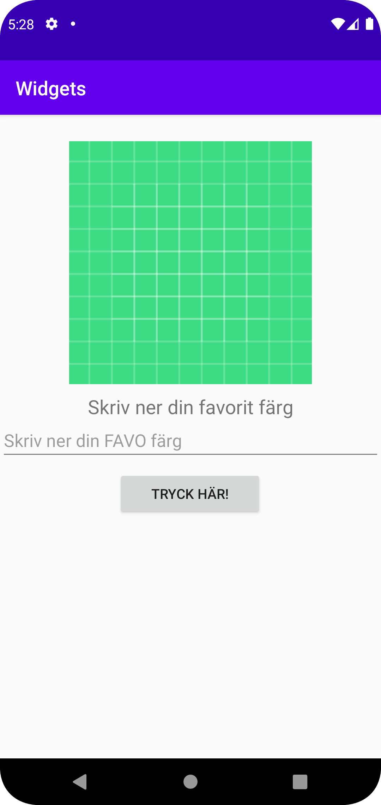

# Rapport
För denna inlämning så användes layouten constraint tillsammans med tre fördefinierade komponenter/widgets som var 
EditText, ImageView och Button, jag lade till TextView för designens skull. Attributet margin lades användes på vissa av komponenterna.
För layouten så skrev man vilka begränsningar då komponenterna hade från deras fyra riktiningar till antingen en parent eller id:et hos en 
annan komponent. 

```
<androidx.constraintlayout.widget.ConstraintLayout ... 

    <ImageView
        android:id="@+id/imageView3"
        android:layout_width="match_parent"
        android:layout_height="250dp"
        . . . 
        app:layout_constraintBottom_toBottomOf="parent"
        app:layout_constraintEnd_toEndOf="parent"
        . . .
        app:layout_constraintStart_toStartOf="parent"
        app:layout_constraintTop_toTopOf="parent"
        . . .
        app:srcCompat="@drawable/ic_launcher_background" />

    <EditText
        android:id="@+id/myEdtText"
        android:layout_width="match_parent"
        android:layout_height="wrap_content"
        . . . 
        app:layout_constraintBottom_toBottomOf="parent"
        app:layout_constraintEnd_toEndOf="parent"
        app:layout_constraintStart_toStartOf="parent"
        app:layout_constraintTop_toTopOf="@+id/imageView3"
        android:layout_marginRight="0dp"
        android:layout_marginLeft="0dp"
        android:layout_marginTop="10dp"
        android:layout_marginBottom="-60dp"
        . . . />
        
        <TextView 
        . . . 
        />

    <Button
        android:id="@+id/mybutton"
        android:layout_width="150dp"
        android:layout_height="wrap_content"
        android:text="@string/app_button"
        app:layout_constraintBottom_toBottomOf="parent"
        app:layout_constraintEnd_toEndOf="parent"
        . . . 
        app:layout_constraintStart_toStartOf="parent"
        app:layout_constraintTop_toTopOf="@id/myEdtText"
        . . . />


</androidx.constraintlayout.widget.ConstraintLayout>
```



